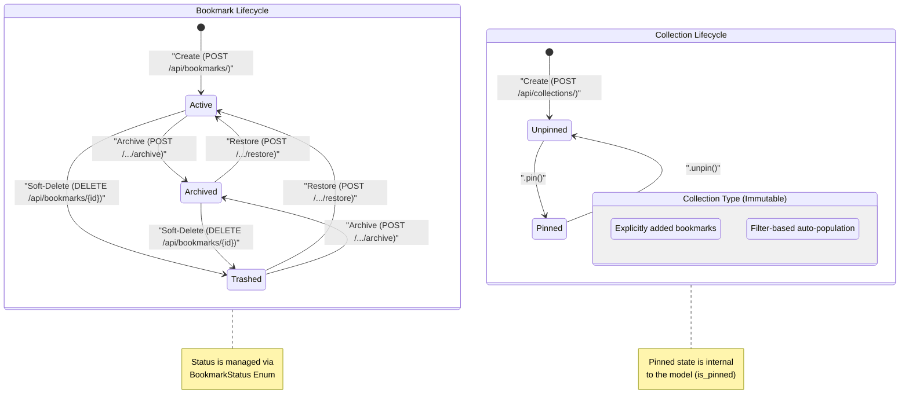

# Bookmark and Collection Lifecycle State Machine

This state diagram illustrates the lifecycle of the two primary entities in the Etchblok API: [Bookmark](/api_ref/app/models/bookmark/bookmark) and [Collection](/api_ref/app/models/collection/collection).

### Bookmark Lifecycle
The [Bookmark](/api_ref/app/models/bookmark/bookmark) entity follows a clear visibility-based lifecycle managed through the `BookmarkStatus` enum. 
- **Active**: The default state for all new bookmarks created via `POST /api/bookmarks/`.
- **Archived**: A state for bookmarks that are preserved but hidden from the main view, triggered by the `/archive` endpoint.
- **Trashed**: A soft-deleted state reached via the `DELETE` method. 
The system allows for flexible restoration and movement between these states (e.g., a trashed bookmark can be archived directly, or an archived one restored to active).

### Collection Lifecycle
The [Collection](/api_ref/app/models/collection/collection) entity has a simpler state model focused on its organization within the UI.
- **Pinned vs. Unpinned**: Managed via the `is_pinned` boolean flag. While the model provides `pin()` and `unpin()` methods, these are currently internal to the domain model and not yet exposed via the public REST API.
- **Manual vs. Smart**: These are defined by the `CollectionType` enum at creation. **Manual** collections require explicit bookmark addition, while **Smart** collections dynamically include bookmarks based on a `filter_rule` (evaluated in the service layer).

The diagram also highlights the triggers for these transitions, mapping them to specific API endpoints or internal model methods discovered during exploration.

**Key Architectural Findings:**
- Bookmarks use a three-state lifecycle (Active, Archived, Trashed) managed by the BookmarkStatus enum.
- The DELETE endpoint for bookmarks performs a soft-delete by transitioning the status to 'trashed' rather than removing the record.
- Transitions between Archived and Trashed states are bidirectional and supported by the model logic.
- Collections have a binary 'Pinned' state and a fixed 'Type' (Manual or Smart) assigned at creation.
- Smart collections use a filter_rule to dynamically aggregate bookmarks, whereas Manual collections use an explicit list of IDs.

