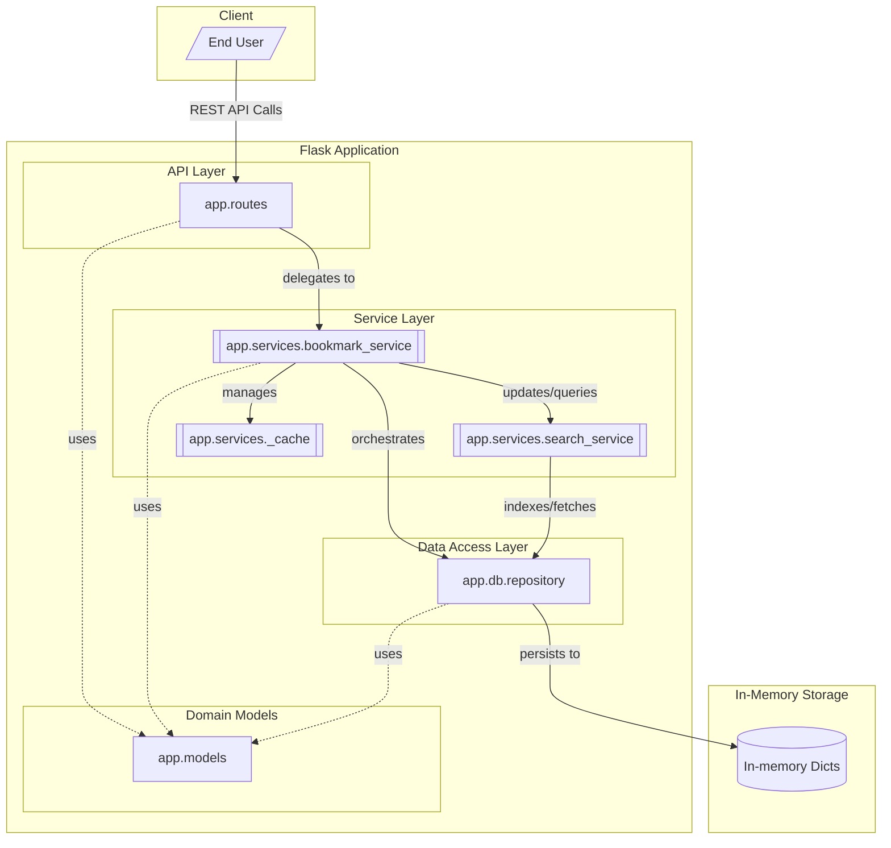

# Bookmark API Component Architecture

The Bookmark API follows a classic layered architecture designed for a RESTful service. 

At the top, the app.routes layer handles incoming HTTP requests via Flask Blueprints, delegating business logic to the service layer. 

The core of the application is the [app.services.bookmark_service](/api_ref/app/bookmark_service), which acts as a singleton orchestrator. It manages the lifecycle of bookmarks, tags, and collections by coordinating between the [app.db.repository](/api_ref/app/repository) for persistence, the [app.services.search_service](/api_ref/app/search_service) for full-text search capabilities, and an internal LRU cache for performance.

The [app.services.search_service](/api_ref/app/search_service) maintains an in-memory inverted index, which it builds and updates by interacting directly with the repository. 

The [app.db.repository](/api_ref/app/repository) implements the repository pattern, abstracting the underlying in-memory storage (dictionaries) from the rest of the application. 

All layers share and operate on the [app.models](/api_ref/app/models), which define the core domain entities like Bookmarks, Tags, and Collections. This separation of concerns ensures that the API logic, business rules, and data access patterns remain decoupled and maintainable.

**Key Architectural Findings:**
- Layered Architecture: Implements a clear separation between API routes, business services, and data repositories.
- Service Orchestration: The BookmarkService acts as a central facade and singleton, managing cross-cutting concerns like caching and search indexing.
- In-memory Search: A custom inverted index in the search_service provides full-text search without an external database dependency.
- Repository Pattern: The repository layer abstracts in-memory storage, allowing for future migration to a persistent database with minimal service-layer changes.
- Domain-Driven Models: Core entities (Bookmark, Tag, Collection) are defined as dataclasses and used as the primary data exchange format across all layers.

