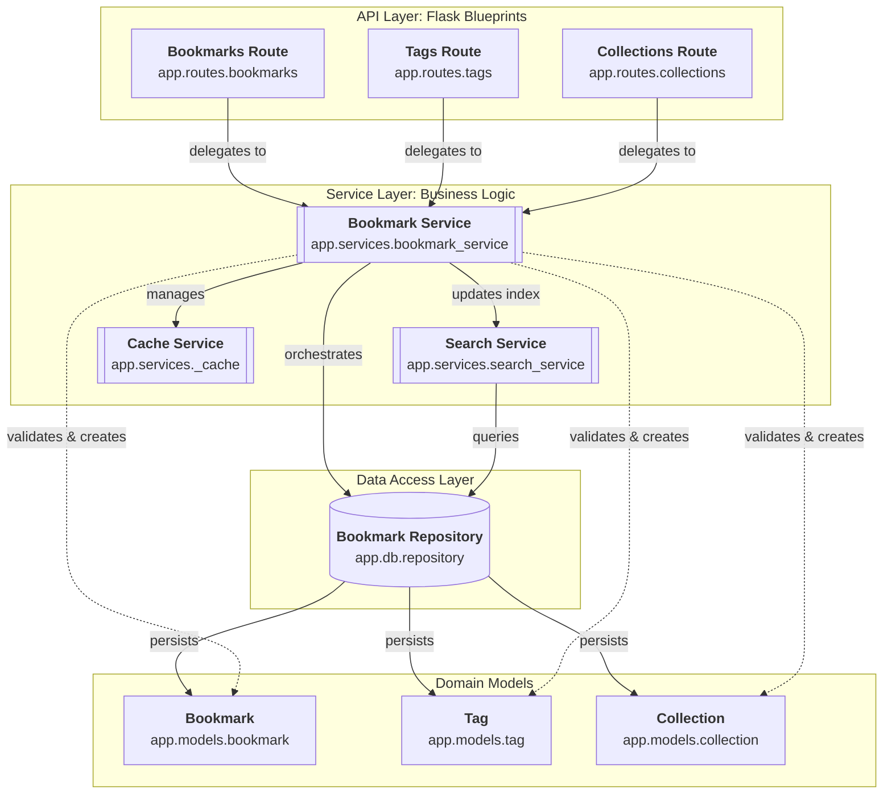

# Bookmark API Component Architecture

The component architecture of the Bookmark API follows a classic layered pattern, with a clear separation between the web interface, business logic, and data persistence.

At the top level, the API Layer consists of Flask Blueprints that handle HTTP requests and responses. These routes do not contain business logic; instead, they delegate all operations to the [Architecture: The Bookmark Service Facade](/guides/bookmark-operations/architecture-the-bookmark-service-facade).

The [Architecture: The Bookmark Service Facade](/guides/bookmark-operations/architecture-the-bookmark-service-facade) is centered around the `BookmarkService`, which acts as a singleton facade. It orchestrates three main sub-components:
1.  **Search Service**: An in-memory inverted index that provides full-text search capabilities.
2.  **Cache Service**: An internal LRU cache used to optimize frequent lookups of individual bookmarks.
3.  **Bookmark Repository**: The data access layer that abstracts the underlying storage.

The [Persistence Layer](/guides/persistence-layer) currently implements an in-memory repository, which manages the lifecycle of the [Domain Models](/guides/domain-models) (Bookmarks, Tags, and Collections). This design allows for easy replacement with a persistent database (like PostgreSQL or SQLite) without modifying the service or route logic.

Key architectural decisions discovered:
- **Singleton Service**: `BookmarkService` ensures a single point of truth for state management across different route modules.
- **Internal Caching**: The cache is encapsulated within the service layer, ensuring that invalidation happens automatically during write operations.
- **In-memory Search**: The search index is rebuilt from the repository on startup and updated incrementally, providing fast search without external dependencies.

**Key Architectural Findings:**
- The application implements a strict layered architecture: Routes -> Services -> Repository.
- BookmarkService is a singleton facade that orchestrates business logic, validation, and cross-component coordination.
- SearchIndex provides full-text search by maintaining an inverted index of bookmark titles and descriptions.
- LRUCache is used internally by the service layer to minimize repository hits for single-entity lookups.
- The BookmarkRepository provides a clean abstraction for data access, currently backed by in-memory dictionaries.

