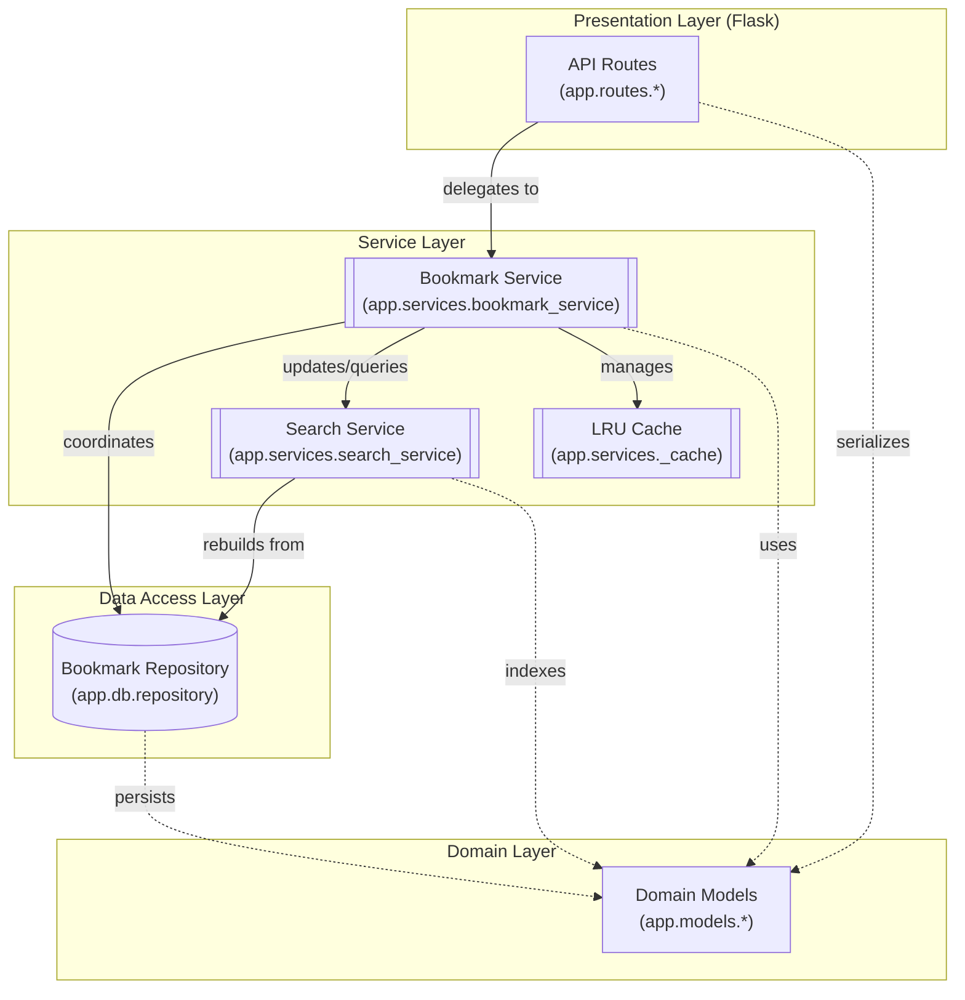

# Bookmark API Component Architecture

The Bookmark API follows a classic layered architecture, where each layer has a distinct responsibility. 

The **Presentation Layer** consists of Flask Blueprints (like `app.routes.bookmarks`) that handle incoming HTTP requests and return JSON responses. These routes do not contain business logic; instead, they delegate all operations to the **Service Layer**.

The **Service Layer** is centered around the `BookmarkService`, which acts as a facade. It orchestrates complex operations, such as creating a bookmark, which involves validation, persisting to the repository, updating the search index, and invalidating the cache. The `SearchIndex` provides full-text search capabilities using an inverted index, while the `LRUCache` improves performance for frequent lookups.

The **Data Access Layer** is represented by the `BookmarkRepository`, which provides an abstraction over the data store. In this implementation, it manages in-memory collections of domain entities.

The **Domain Layer** contains the core data models (`Bookmark`, `Tag`, `Collection`) which are used throughout the application to pass data between layers.

Key design patterns discovered include the **Singleton** pattern for the `BookmarkService` to ensure shared state across the application, and the **Repository** pattern to decouple business logic from data storage details.

**Key Architectural Findings:**
- The `BookmarkService` acts as a central facade and singleton, orchestrating interactions between the repository, search index, and cache.
- The `SearchIndex` maintains an inverted index in memory, rebuilding it from the `BookmarkRepository` on initialization.
- An internal `LRUCache` is used by the service layer to optimize bookmark retrieval by ID.
- The `BookmarkRepository` provides a clean abstraction for CRUD operations, currently implemented as an in-memory store.
- Domain models like `Bookmark` are implemented as dataclasses with self-contained logic for state transitions (e.g., archive, trash).

