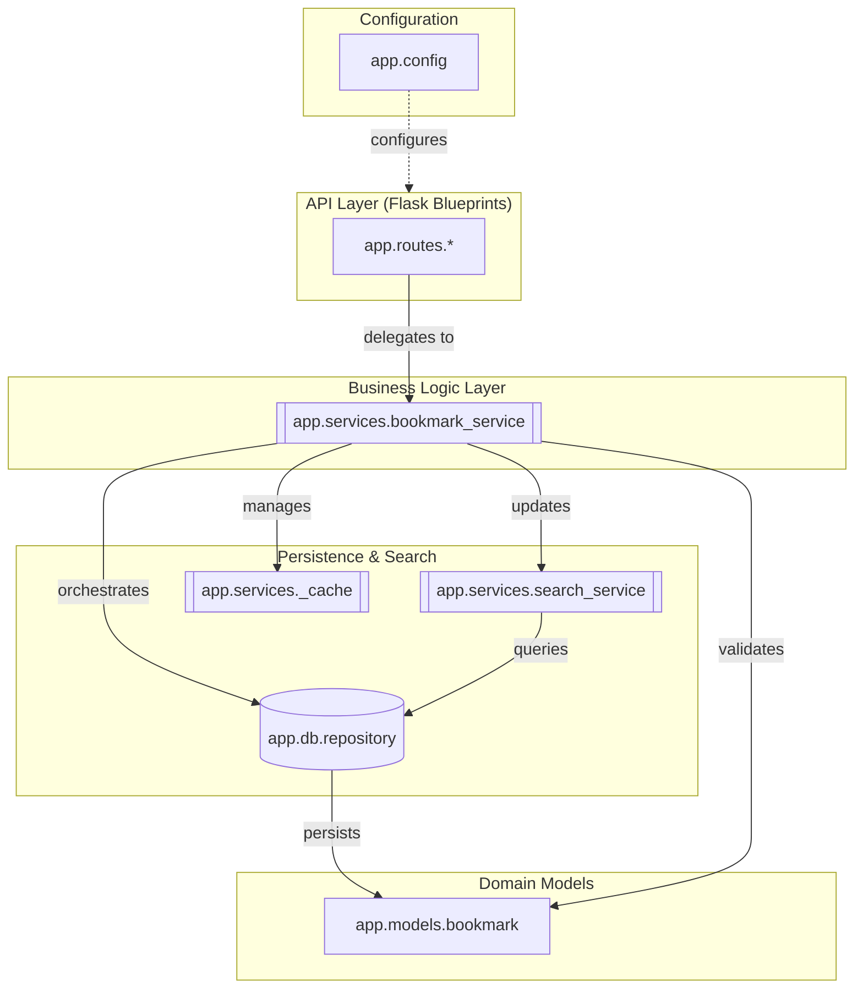

# Bookmark API Internal Component Architecture

The internal architecture of the Bookmark API follows a classic layered pattern, centered around a service-oriented design. 

At the core is the [app.services.bookmark_service](/api_ref/app/bookmark_service), which acts as a facade and orchestrator for all business logic. It is implemented as a singleton to ensure consistent state across the application's Flask blueprints. This service coordinates between the [app.db.repository](/api_ref/app/repository) for data persistence, the [app.services.search_service](/api_ref/app/search_service) for full-text indexing, and an internal [Service Architecture and Caching](/guides/bookmark-services/service-architecture-and-caching) for performance optimization.

The [app.db.repository](/api_ref/app/repository) provides an abstraction over the data storage, currently implemented as an in-memory store for [Bookmark](/api_ref/app/models/bookmark/bookmark) and other domain entities. The [app.services.search_service](/api_ref/app/search_service) maintains an inverted index of bookmark titles and descriptions, allowing for efficient keyword searches.

The [app.config](/api_ref/app/config) module provides environment-specific settings that configure the Flask application and its various components. The API layer, composed of several Flask blueprints, delegates all complex operations to the service layer, ensuring a clean separation of concerns.

**Key Architectural Findings:**
- BookmarkService is a singleton facade that orchestrates business logic, validation, and cross-component coordination.
- The system uses an in-memory BookmarkRepository for data persistence, abstracting the storage implementation from the service layer.
- A custom SearchIndex provides full-text search capabilities by tokenizing bookmark content and maintaining an inverted index.
- An internal LRUCache is used by the BookmarkService to speed up frequent bookmark lookups and is automatically invalidated on updates.
- The application follows a strict layered architecture: Routes (API) -> Services (Logic) -> Repository/Search/Cache (Data).

