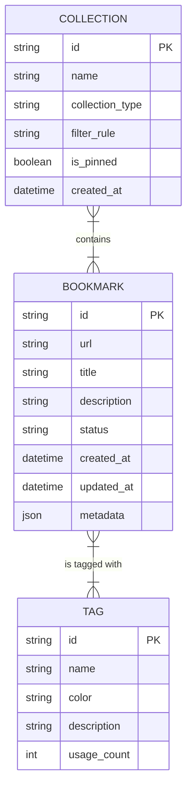

# Bookmark Domain Data Model

The data model for the Bookmark Management API is centered around three primary domain entities: [Bookmark](/api_ref/app/models/bookmark/bookmark), [Collection](/api_ref/app/models/collection/collection), and [Tag](/api_ref/app/models/tag/tag). These entities are implemented as Python dataclasses and managed via an in-memory repository.

### Key Entities

- **Bookmark**: The core entity representing a saved URL. It includes metadata like title, description, and a status (Active, Archived, or Trashed). It also supports an extensible `metadata` dictionary for additional properties.
- **Tag**: A label that can be applied to bookmarks for organization. Each tag has a name, a color (from a fixed set of [TagColor](/api_ref/app/models/tag/tagcolor) values), and tracks its own `usage_count`.
- **Collection**: A grouping mechanism for bookmarks. Collections can be **Manual** (where bookmarks are added explicitly) or **Smart** (where bookmarks are automatically included based on a `filter_rule` that matches titles or descriptions).

### Relationships

- **Bookmark <-> Tag**: A many-to-many relationship. A bookmark can have multiple tags, and a tag can be associated with many bookmarks. This is implemented via a list of tag IDs stored on the `Bookmark` entity.
- **Collection <-> Bookmark**: A many-to-many relationship. A collection contains a list of bookmark IDs. While a bookmark typically belongs to one or more collections, the relationship is managed by the `Collection` entity. Smart collections dynamically resolve their member bookmarks at runtime based on their filter rules.

### Enumerations

The model uses several enumerations to define fixed states:
- `BookmarkStatus`: `ACTIVE`, `ARCHIVED`, `TRASHED`
- `CollectionType`: `MANUAL`, `SMART`
- `TagColor`: `RED`, `BLUE`, `GREEN`, `YELLOW`, `PURPLE`, `GRAY`

**Key Architectural Findings:**
- Entities are implemented as Python dataclasses with UUID-based string primary keys of varying lengths (12 chars for Bookmarks, 10 for Collections, 8 for Tags).
- Relationships are managed through ID lists (e.g., Bookmark.tags, Collection.bookmark_ids) rather than traditional ORM back-references, reflecting the in-memory repository architecture.
- The system supports 'Smart Collections' which use a filter_rule string to dynamically group bookmarks based on text matching in titles and descriptions.
- Bookmarks include a flexible metadata dictionary for extensibility beyond the core fields.
- Tags maintain a usage_count which is incremented/decremented by the service layer when tags are attached or removed.

