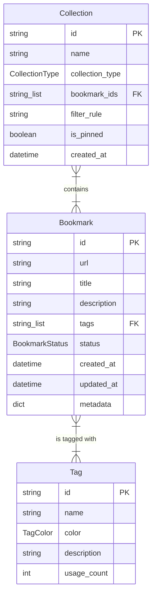

# Bookmark Domain Data Model

The data model for the Pagemark API is centered around three primary domain entities: [Bookmark](/api_ref/app/models/bookmark/bookmark), [Tag](/api_ref/app/models/tag/tag), and [Collection](/api_ref/app/models/collection/collection). 

- **Bookmark**: The core entity representing a saved URL. It contains metadata such as title, description, and status (Active, Archived, Trashed). It maintains a list of associated tag IDs.
- **Tag**: A label used to organize bookmarks. Each tag has a name, a color, and a usage count that tracks how many bookmarks are currently using it.
- **Collection**: A grouping mechanism for bookmarks. Collections can be **manual** (where users explicitly add bookmarks) or **smart** (where bookmarks are automatically included based on a `filter_rule`).

The relationships are many-to-many:
- A **Bookmark** can have multiple **Tags**, and a **Tag** can be applied to multiple **Bookmarks**. This is implemented via a list of tag IDs within the Bookmark entity.
- A **Collection** can contain multiple **Bookmarks**, and a **Bookmark** can belong to multiple **Collections**. This is implemented via a list of bookmark IDs within the Collection entity.

Note: Although "User" was identified as a key entity in the system classification, the current codebase implements an in-memory repository that does not yet include a formal `User` model or multi-tenant support. References to "users" in the code comments suggest future intent for per-user uniqueness constraints.

**Key Architectural Findings:**
- The system uses a flat, in-memory data model with entities defined as Python dataclasses.
- Relationships (Bookmark-Tag and Collection-Bookmark) are managed using lists of identifiers rather than formal ORM relationship objects.
- Enums are used extensively to define states: BookmarkStatus (ACTIVE, ARCHIVED, TRASHED), TagColor (RED, BLUE, etc.), and CollectionType (MANUAL, SMART).
- Smart Collections use a 'filter_rule' string to dynamically select bookmarks based on title or description matches.
- The 'User' entity is mentioned in documentation and comments but is not yet implemented as a class or database field.

