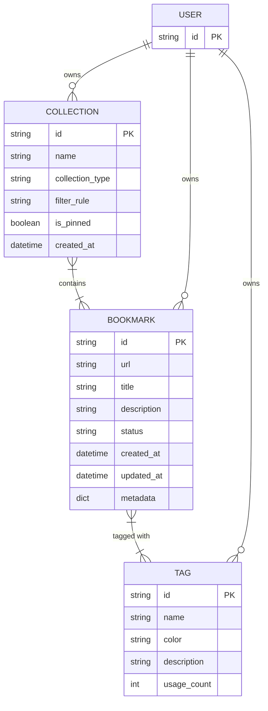

# Bookmark Domain Entity Relationship Diagram

The data model for the Pagemark API centers around three core domain entities: [Bookmark](/api_ref/app/models/bookmark/bookmark), [Collection](/api_ref/app/models/collection/collection), and [Tag](/api_ref/app/models/tag/tag). 

- **Bookmark**: The primary entity, representing a saved URL with metadata. It maintains a many-to-many relationship with **Tags** via a list of tag IDs. It also tracks its lifecycle state through a `status` field (Active, Archived, or Trashed).
- **Tag**: A label used to organize bookmarks. It includes a `usage_count` to track how many bookmarks it is attached to and a `color` for UI categorization.
- **Collection**: A grouping mechanism for bookmarks. Collections can be **Manual** (explicitly added bookmarks) or **Smart** (automatically populated based on a `filter_rule`). It maintains a many-to-many relationship with **Bookmarks**.
- **User**: While not explicitly defined as a model class in the current implementation, it is a key logical entity mentioned in domain requirements (e.g., tags being unique per user).

The relationships are implemented using ID references in the model classes, reflecting the in-memory repository's structure where entities are stored in dictionaries and linked by their unique identifiers.

**Key Architectural Findings:**
- The system uses Python dataclasses for domain models (Bookmark, Collection, Tag).
- Relationships are managed via lists of IDs (e.g., Bookmark.tags, Collection.bookmark_ids) rather than ORM-style object references.
- Enums are used to define fixed states for BookmarkStatus, CollectionType, and TagColor.
- A User entity is implied by domain constraints (e.g., Tag uniqueness) but is not yet explicitly modeled in the persistence layer.
- Smart Collections use a filter_rule string to dynamically select bookmarks, while Manual Collections store a static list of IDs.

