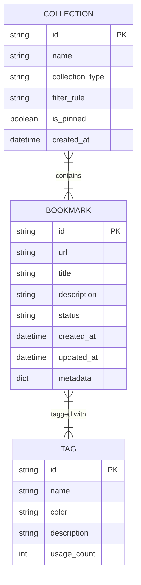

# Bookmark Domain Entity Relationship Diagram

This data model diagram represents the core domain entities of the Pagemark API: [The Bookmark Entity](/guides/domain-models/the-bookmark-entity), [Categorization with Tags](/guides/domain-models/categorization-with-tags), and [Grouping with Collections](/guides/domain-models/grouping-with-collections). 

- **Bookmark**: The central entity representing a saved URL. It contains metadata like title, description, and status (Active, Archived, Trashed). It maintains a many-to-many relationship with Tags.
- **Tag**: A label used to organize bookmarks. It includes a name, color, and a usage count.
- **Collection**: A grouping mechanism for bookmarks. Collections can be 'manual' (explicitly added) or 'smart' (populated via a filter rule).

The relationships are implemented using lists of IDs within the dataclasses, representing many-to-many associations between Bookmarks and Tags, and between Collections and Bookmarks. Although a 'User' entity was requested, no such entity or 'user_id' field was found in the current codebase; the system appears to operate in a single-user context or delegates user management to an external layer not reflected in these models.

**Key Architectural Findings:**
- The codebase uses Python dataclasses to define domain models: Bookmark, Tag, and Collection.
- Relationships are managed via lists of IDs (e.g., Bookmark.tags and Collection.bookmark_ids), indicating many-to-many relationships.
- Enums are used for entity states and types: BookmarkStatus (ACTIVE, ARCHIVED, TRASHED), TagColor, and CollectionType (MANUAL, SMART).
- No User entity or user-specific foreign keys were found in the model definitions, despite being mentioned in documentation comments.
- The Bookmark entity includes a metadata dictionary for extensibility.

