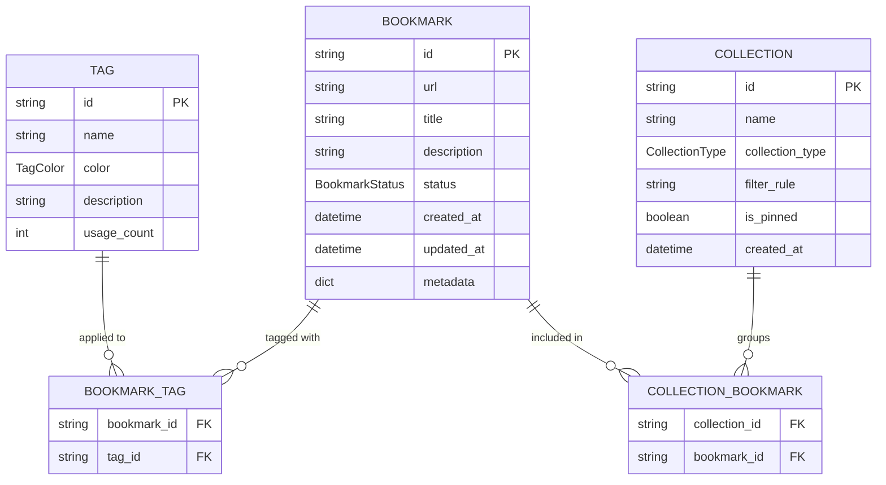

# Bookmark Domain Entity Relationship Diagram

The Bookmark Domain Entity Relationship Diagram illustrates the core data structures and their associations within the Etchblok API. 

### Core Entities
- **Bookmark**: The central entity representing a saved URL. It includes metadata like `title`, `description`, and `status` (Active, Archived, Trashed). It also tracks its own lifecycle via `created_at` and `updated_at` timestamps.
- **Tag**: A label used to categorize bookmarks. Each tag has a `name`, a `color` (from a predefined set of Enums), and a `usage_count` that tracks how many bookmarks it is attached to.
- **Collection**: A grouping mechanism for bookmarks. Collections can be **Manual** (where bookmarks are explicitly added) or **Smart** (where bookmarks are automatically included based on a `filter_rule`).

### Relationships
- **Bookmark-Tag Association**: A many-to-many relationship. In the code, this is implemented as a list of tag IDs within the `Bookmark` dataclass. The diagram represents this via the `BOOKMARK_TAG` association entity.
- **Collection-Bookmark Association**: A many-to-many relationship. A collection can contain multiple bookmarks, and a bookmark can belong to multiple collections. In the code, this is managed by the `bookmark_ids` list in the `Collection` dataclass.

### Implementation Details
The system uses an in-memory repository (`BookmarkRepository`) to manage these entities. While the current implementation uses Python dataclasses and lists for relationships, the diagram reflects the logical relational model that these structures represent. Enums like `BookmarkStatus`, `TagColor`, and `CollectionType` provide domain-specific constraints on the entity attributes.

**Key Architectural Findings:**
- The system uses Python dataclasses (Bookmark, Tag, Collection) to represent domain entities.
- Relationships are managed via lists of IDs (e.g., Bookmark.tags, Collection.bookmark_ids), representing many-to-many associations.
- Enums are used for entity states and types: BookmarkStatus (ACTIVE, ARCHIVED, TRASHED), TagColor (RED, BLUE, etc.), and CollectionType (MANUAL, SMART).
- The BookmarkRepository provides an in-memory abstraction for CRUD operations on these entities.
- Smart Collections use a 'filter_rule' string to dynamically select bookmarks based on title or description matches.

