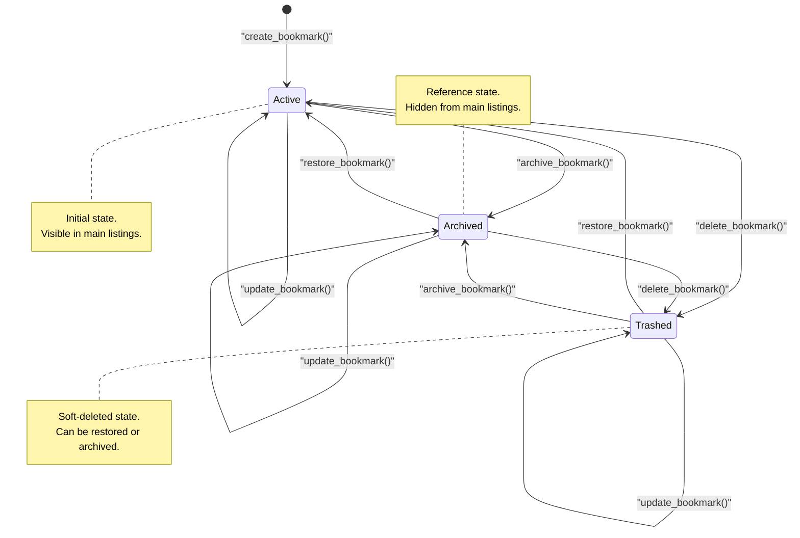

# Bookmark Entity Lifecycle

The state diagram illustrates the lifecycle of a [Bookmark](/api_ref/app/models/bookmark/bookmark) entity within the system. 

A bookmark begins its lifecycle in the **Active** state upon creation via the `create_bookmark` service method. From there, it can transition between three primary states: **Active**, **Archived**, and **Trashed**.

- **Active**: The default state where the bookmark is fully visible and searchable.
- **Archived**: A state for bookmarks that are no longer active but kept for reference. This is triggered by the `archive_bookmark` method.
- **Trashed**: A soft-deleted state. Bookmarks are moved here via the `delete_bookmark` method instead of being immediately removed from the database.

Key characteristics of these transitions include:
- **Restoration**: Bookmarks in either the **Archived** or **Trashed** states can be returned to the **Active** state using the `restore_bookmark` method.
- **Inter-state movement**: The system allows moving a bookmark directly from **Trashed** to **Archived** and vice versa, providing flexibility in how users manage their saved content.
- **Metadata Updates**: The `update_bookmark` method allows modifying fields like title and URL without changing the bookmark's status. Every state transition (including updates) triggers an internal `_touch()` call that refreshes the `updated_at` timestamp.
- **Persistence**: All state changes are persisted via the `BookmarkRepository`, and the internal cache is invalidated to ensure consistency across the service.

**Key Architectural Findings:**
- The Bookmark entity uses a BookmarkStatus enum with three values: ACTIVE, ARCHIVED, and TRASHED.
- The delete_bookmark service method performs a soft-delete by transitioning the bookmark to the TRASHED state rather than removing it from the repository.
- The restore_bookmark method is a unified way to move bookmarks from both ARCHIVED and TRASHED states back to ACTIVE.
- Every state transition calls a private _touch() method to update the modification timestamp (updated_at).
- The repository contains a hard-delete method (delete_bookmark), but it is not currently exposed through the BookmarkService or the REST API.

