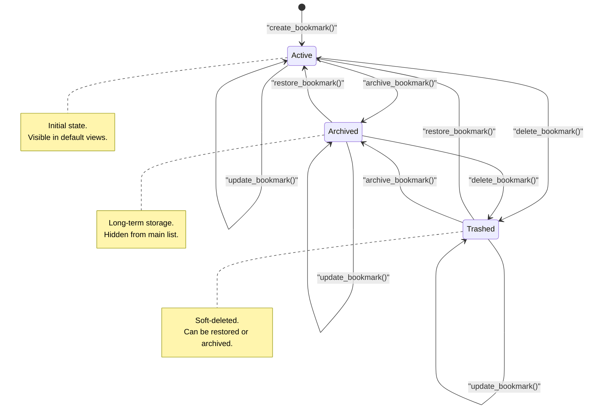

# Bookmark Entity Lifecycle

This state diagram depicts the lifecycle of the [The Bookmark Entity](/guides/core-entities/the-bookmark-entity) entity. A bookmark is initialized in the `ACTIVE` state upon creation. It can transition between three primary states: `ACTIVE`, `ARCHIVED`, and `TRASHED`. The `TRASHED` state acts as a soft-delete mechanism, allowing bookmarks to be recovered later. Transitions are managed by the `BookmarkService`, which ensures that the `updated_at` timestamp is refreshed (via the `_touch` method) whenever a state change occurs. While the repository layer supports hard deletion, the current service implementation focuses on these three managed states.

**Key Architectural Findings:**
- The `Bookmark` entity uses a `BookmarkStatus` enum with three values: `ACTIVE`, `ARCHIVED`, and `TRASHED`.
- New bookmarks are always created in the `ACTIVE` state by default.
- The `delete_bookmark` service method performs a soft-delete by transitioning the entity to the `TRASHED` state.
- The `restore_bookmark` method is used to return both `ARCHIVED` and `TRASHED` bookmarks to the `ACTIVE` state.
- Transitions are not restricted by the current state; for example, a `TRASHED` bookmark can be directly `ARCHIVED` and vice versa.
- Every state transition triggers a call to the internal `_touch()` method to update the modification timestamp.

