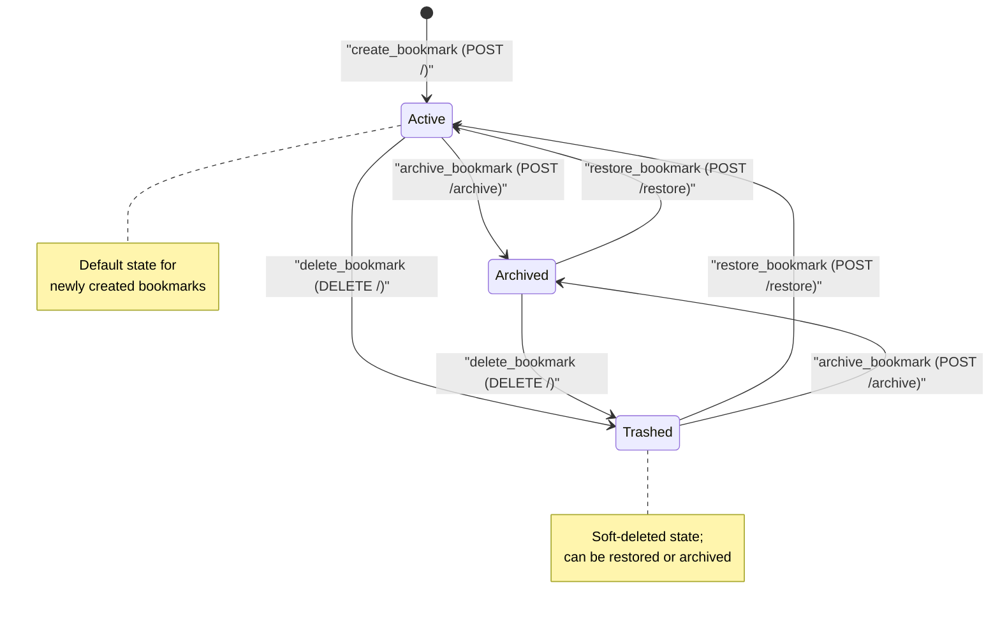

# Bookmark Entity Lifecycle

The state machine for the [Bookmark](/api_ref/app/models/bookmark/bookmark) entity is managed through the `BookmarkStatus` enum. It follows a simple lifecycle where bookmarks are created in an **Active** state and can be moved to **Archived** or **Trashed** (soft-deleted) states. 

The system uses a layered approach where the [BookmarkService](/api_ref/app/services/bookmark/service/bookmarkservice) orchestrates these transitions by calling domain methods on the `Bookmark` model and then persisting the changes via the [BookmarkRepository](/api_ref/app/db/repository/bookmarkrepository). 

Key characteristics of this lifecycle include:
- **Soft Deletion**: The `delete_bookmark` operation does not remove the record from the database but instead transitions it to the `TRASHED` state.
- **Bidirectional Transitions**: The model allows moving between any of the three states (Active, Archived, Trashed) without restrictive guard conditions, provided the bookmark exists.
- **Persistence**: Every state transition triggers a `_touch()` call to update the `updated_at` timestamp and is immediately saved to the repository.

**Key Architectural Findings:**
- Bookmarks have three primary states: ACTIVE, ARCHIVED, and TRASHED, defined in the BookmarkStatus enum.
- The initial state for any new bookmark is ACTIVE, set during instantiation in the Bookmark dataclass.
- Transitions are triggered by specific API endpoints: DELETE /\<id> (trash), POST /\<id>/archive, and POST /\<id>/restore.
- The delete_bookmark service method implements a 'soft-delete' pattern by moving the entity to the TRASHED state rather than removing it.
- The domain model (Bookmark class) provides explicit methods (archive, trash, restore) to handle these state changes and update the modification timestamp.

