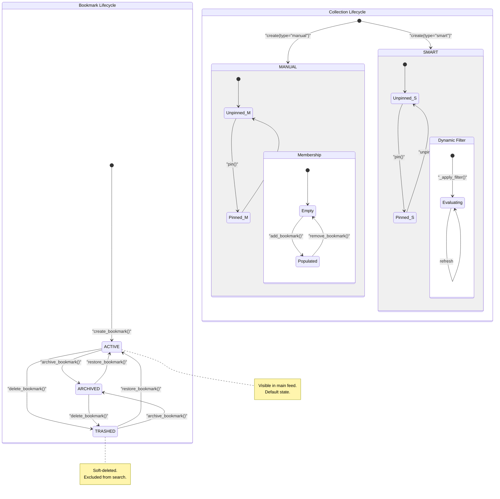

# Bookmark Lifecycle State Machine

This state diagram illustrates the lifecycle of the two primary entities in the Etchblok API: [The Bookmark Entity](/guides/domain-models/the-bookmark-entity) and [Understanding Collections](/guides/categorization-collections/understanding-collections).

The **Bookmark Lifecycle** is governed by the `BookmarkStatus` enum. Every bookmark begins in the `ACTIVE` state upon creation. From there, it can be moved to `ARCHIVED` (for long-term storage) or `TRASHED` (a soft-delete state). The system allows for fluid transitions between these states: a trashed item can be restored to active or moved directly to the archive, and an archived item can be trashed or restored. All state transitions trigger a "touch" operation that updates the `updated_at` timestamp.

The **Collection Lifecycle** is defined by the `CollectionType` (Manual vs. Smart) and a pinning mechanism. 
- **Manual Collections** are user-managed lists where bookmarks are explicitly added or removed.
- **Smart Collections** are dynamic and populate themselves based on a `filter_rule` (e.g., matching keywords in titles or descriptions).
- Both types support a **Pinned** state (via the `is_pinned` flag), which determines their visibility in the UI sidebar, although the current REST API implementation primarily focuses on the creation and membership management of these collections.

Key architectural decisions discovered include the use of **soft-deletion** for bookmarks (moving them to `TRASHED` rather than immediate removal) and the **singleton service pattern** (`BookmarkService`) which orchestrates these state changes across the repository and search index.

**Key Architectural Findings:**
- Bookmarks use a three-state lifecycle: ACTIVE, ARCHIVED, and TRASHED.
- The 'delete' operation in the BookmarkService is a soft-delete that transitions the entity to the TRASHED state.
- Restoration (restore_bookmark) always returns a bookmark to the ACTIVE state, regardless of whether it was archived or trashed.
- Collections are categorized into MANUAL and SMART types at creation, which dictates how their membership is managed.
- A pinning mechanism (is_pinned) exists in the Collection model to manage UI priority, though it is not yet exposed via the public REST routes.
- Every state transition in the Bookmark model calls an internal _touch() method to maintain auditability via updated_at timestamps.

