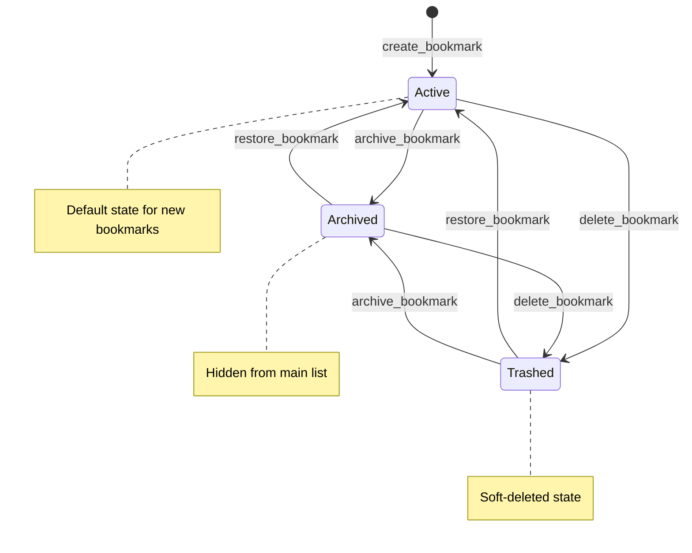

# Bookmark Lifecycle States

The state diagram illustrates the lifecycle of a [Bookmark](/api_ref/app/models/bookmark/bookmark) entity within the system. 

### States
- **Active**: The default state for a newly created bookmark. These bookmarks are typically visible in the user's primary list.
- **Archived**: A state for bookmarks that the user wants to keep but remove from the active view.
- **Trashed**: A soft-deleted state. Bookmarks in this state are hidden from normal views but can still be restored.

### Transitions
- **Creation**: A bookmark enters the **Active** state upon creation via the `create_bookmark` service method.
- **Archiving**: A bookmark can be moved to the **Archived** state from either the **Active** or **Trashed** states using the `archive_bookmark` endpoint.
- **Trashing**: A bookmark is moved to the **Trashed** state via the `delete_bookmark` endpoint (which performs a soft-delete). This can happen from either the **Active** or **Archived** states.
- **Restoration**: A bookmark in the **Archived** or **Trashed** state can be returned to the **Active** state using the `restore_bookmark` endpoint.

The architecture uses a soft-delete pattern where the `TRASHED` status acts as a safety net before any potential (though currently unimplemented in the API) hard deletion. All state transitions are handled by the `BookmarkService` which updates the `status` field on the `Bookmark` model and persists the change via the `BookmarkRepository`.

**Key Architectural Findings:**
- The Bookmark entity has three primary states: ACTIVE, ARCHIVED, and TRASHED, defined in the BookmarkStatus enum.
- New bookmarks are initialized to the ACTIVE state by default.
- The API's DELETE method performs a soft-delete by transitioning the bookmark to the TRASHED state rather than removing it from the database.
- Transitions between states are fluid; for example, a bookmark can move directly from TRASHED to ARCHIVED or vice versa.
- The BookmarkRepository contains a hard-delete method (delete_bookmark), but it is not currently exposed through the BookmarkService or the REST API.

