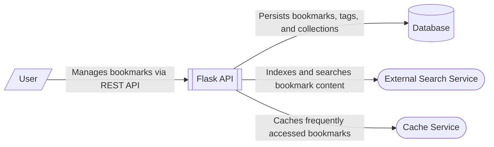

# Bookmark Management System Context

This system context diagram illustrates the **Pagemark API** as the central component of a bookmark management ecosystem. The API, built with [Flask API Layered Architecture](/architecture/architecture-overview/flask-api-layered-architecture), serves as the orchestration layer for managing bookmarks, tags, and collections.

The diagram highlights the following key interactions:
- **User**: End-users or client applications interact with the system via a RESTful HTTP API to perform CRUD operations on bookmarks and organize them into collections.
- **Database**: A persistent storage layer (designed for [Data Persistence](/guides/data-persistence)) where the API stores domain entities such as bookmarks, tags, and collection metadata.
- **External Search Service**: The API integrates with a search service (intended to be [Search & Indexing](/guides/search-indexing) or [Search & Indexing](/guides/search-indexing)) to provide full-text search capabilities across bookmark titles and descriptions.
- **Cache Service**: An LRU-based caching layer (implemented in-memory but extensible to [In-Memory Persistence](/guides/data-persistence/understanding-in-memory-persistence)) is used to optimize performance for frequently accessed bookmark data.

The architecture follows a clean separation of concerns, with a dedicated repository layer for data access and a service layer for business logic and external service orchestration.

**Key Architectural Findings:**
- The system is a Flask-based REST API with a layered architecture (Routes, Services, Repository, Models).
- A dedicated database connection module (`app/db/_connection.py`) defines a pool for a PostgreSQL-compatible database.
- The search functionality is abstracted into a `SearchIndex` service, designed to be backed by external full-text search engines.
- An internal LRU cache is used by the `BookmarkService` to reduce database load for read-heavy operations.
- The API includes internal health and readiness probes (`/_internal/health`) intended for use by load balancers and monitoring systems.

