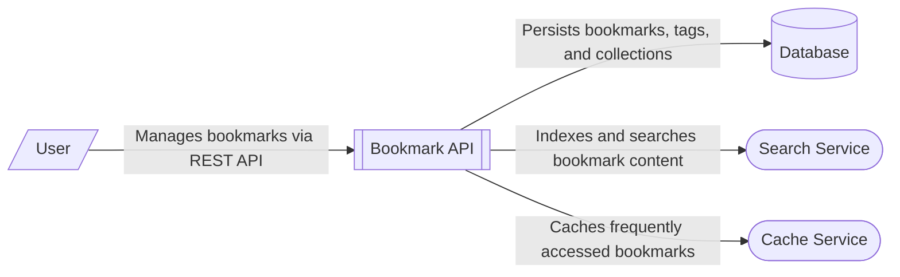

# Bookmark Management System Context

The Bookmark Management System is a backend web service that provides a REST API for managing bookmarks, tags, and collections. 

- **User**: Represents the end users or client applications that interact with the [Bookmark API Component Architecture](/architecture/architecture-overview/bookmark-api-component-architecture) via HTTP/REST endpoints to perform CRUD operations on bookmarks and organize them into tags and collections.
- **Bookmark API**: The core system built with the Flask framework. It orchestrates business logic through a layered architecture consisting of routes, services, and repositories.
- **Database**: A persistent storage layer (configured for PostgreSQL) where bookmarks, tags, and collections are stored. While the current implementation uses an in-memory repository, the architecture is designed to integrate with a relational database.
- **Search Service**: Provides full-text search capabilities. It currently uses an internal inverted index to allow users to search through bookmark titles and descriptions, but is designed to be replaced by external services like Elasticsearch or Typesense.
- **Cache Service**: An LRU (Least Recently Used) cache that stores frequently accessed bookmarks in memory to reduce database load and improve response times.

The system follows a clean separation of concerns, where the [BookmarkService](/api_ref/app/services/bookmark/service/bookmarkservice) acts as a facade, coordinating between the repository, search index, and cache.

**Key Architectural Findings:**
- The system is a Flask-based REST API with a layered architecture (Routes -> Services -> Repositories).
- Persistence is handled by a repository layer, with configuration present for a PostgreSQL database.
- A dedicated SearchIndex service provides full-text search using an inverted index.
- An internal LRUCache is used by the service layer to optimize bookmark retrieval.
- The API exposes endpoints for bookmarks, tags, and collections, including search and health check capabilities.

