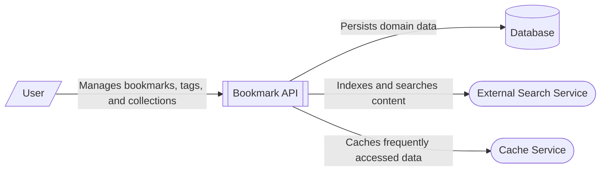

# Bookmark Management System Context

This system context diagram depicts the **Bookmark Management System** (Bookmark API) and its interactions with external actors and dependencies. 

The central component is the **Bookmark API**, a Flask-based RESTful service that provides endpoints for managing bookmarks, tags, and collections. 

- **User**: Represents the end-users who interact with the system via the REST API to perform CRUD operations on their bookmarks.
- **Database**: A PostgreSQL database (as indicated by the internal connection configuration) used for persistent storage of domain entities like bookmarks, tags, and collections.
- **External Search Service**: A full-text search engine (such as Elasticsearch or Typesense) that the API uses to index bookmark content and provide advanced search capabilities. While currently implemented as an in-memory index, the architecture is designed for external integration.
- **Cache Service**: A caching layer (like Redis) used to store frequently accessed bookmark data to reduce database load and improve response times. The codebase includes an LRU cache implementation as a placeholder for this service.

The diagram shows the flow of data and requests between these components, highlighting the system's role as an orchestrator between user requests and backend storage/search services.

**Key Architectural Findings:**
- The Bookmark API is a Flask-based service providing RESTful endpoints for bookmark management.
- Data persistence is architected for a PostgreSQL database, with connection settings pointing to port 5432.
- Full-text search is decoupled into a dedicated service, with the codebase providing an in-memory implementation that is production-ready for Elasticsearch or Typesense.
- A caching layer (LRU cache) is integrated into the service layer to optimize bookmark retrieval.
- The system follows a layered architecture (Routes -> Services -> Repository/Search/Cache) to maintain separation of concerns.

