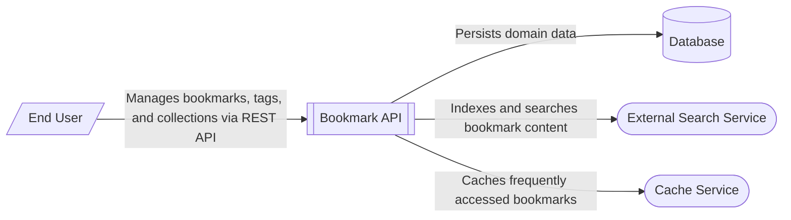

# Bookmark Management System Context

The Bookmark Management System Context diagram illustrates the high-level interactions between the **Bookmark API** and its external environment. 

The **Bookmark API** is a Flask-based REST service that provides endpoints for managing bookmarks, tags, and collections. It serves as the central hub for business logic, orchestrating data between the user and various storage and utility services.

Key interactions include:
- **End Users** interact with the system via a RESTful API to perform CRUD operations on bookmarks, organize them into collections, and apply tags.
- The **Database** (represented in the code by a PostgreSQL connection stub) is used for persistent storage of domain entities like bookmarks, tags, and collections.
- An **External Search Service** (implemented as an in-memory inverted index in the current codebase) provides full-text search capabilities across bookmark titles and descriptions.
- A **Cache Service** (implemented as an in-memory LRU cache) is used to store frequently accessed bookmarks, reducing the load on the primary database and improving response times for read operations.

While the current implementation uses in-memory stubs for the database, search, and cache components, the architecture is designed to integrate with external systems like PostgreSQL, Elasticsearch, and Redis in a production environment. [BookmarkService](/api_ref/app/services/bookmark/service/bookmarkservice) acts as a facade that abstracts these integrations from the route handlers.

**Key Architectural Findings:**
- The system is a Flask-based REST API following a layered architecture (Routes, Services, Repository, Models).
- Persistence is managed through a repository pattern, with stubs for a PostgreSQL database connection pool.
- Full-text search is provided by a dedicated SearchIndex service that maintains an inverted index of bookmark content.
- Performance is optimized using an LRU (Least Recently Used) cache for bookmark lookups.
- The API includes internal health and readiness probes intended for use by load balancers and monitoring systems.

