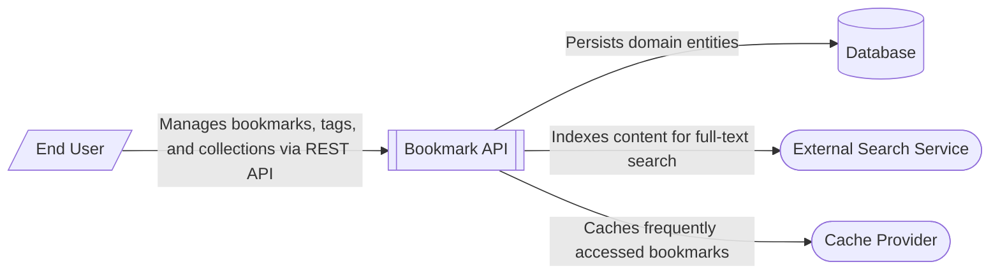

# Bookmark Management System Context

This system context diagram depicts the [Bookmark API Architecture](/architecture/architecture-overview/bookmark-api-internal-component-architecture) as the central system managing bookmark data. It interacts with an End User who consumes the REST API to perform CRUD operations on bookmarks, tags, and collections. The system relies on three primary external-facing components (currently implemented as in-memory stubs or internal services): a [Data Persistence](/guides/data-persistence) for persistent storage of domain entities, an [Search Architecture](/guides/search-indexing/search-architecture) for full-text indexing and retrieval, and a [Cache Configuration](/guides/configuration-environments/optimizing-cache-for-environments) to optimize performance for frequently accessed resources.

The architecture follows a clean separation of concerns, where the API layer delegates business logic to a service layer, which in turn orchestrates interactions with the repository (database), search index, and cache. While the current implementation uses in-memory versions of these dependencies, the codebase includes configuration and connection stubs (e.g., for PostgreSQL) to facilitate future integration with real external systems.

**Key Architectural Findings:**
- The system is a Flask-based REST API providing endpoints for bookmarks, tags, and collections management.
- A service layer (BookmarkService) acts as a facade, orchestrating logic between the API routes and the data/search layers.
- Data persistence is abstracted through a repository pattern, currently using an in-memory store but designed for a PostgreSQL-like database.
- Full-text search is provided by an inverted index (SearchIndex) that tokenizes bookmark titles and descriptions.
- Performance is enhanced by an internal LRU cache that stores recently accessed bookmark objects.
- Internal health and diagnostic endpoints are provided for monitoring and readiness checks.

