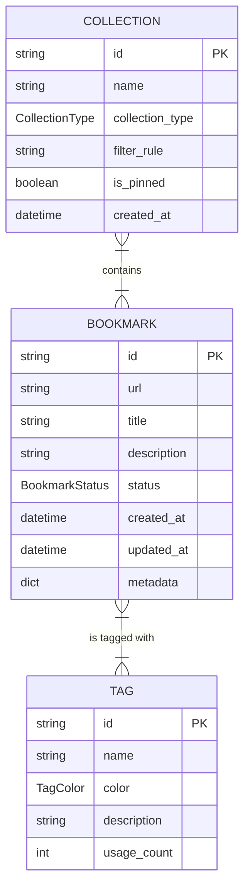

# Domain Data Model for Bookmarks, Collections, and Tags

The domain data model for the Pagemark API is centered around three primary entities: [Bookmark](/api_ref/app/models/bookmark/bookmark), [Collection](/api_ref/app/models/collection/collection), and [Tag](/api_ref/app/models/tag/tag). 

- **Bookmark**: The core entity representing a saved URL. It contains metadata such as title, description, and status (Active, Archived, or Trashed). It maintains a many-to-many relationship with Tags.
- **Tag**: A label used to organize bookmarks. Each tag has a name, a color for UI representation, and a usage count.
- **Collection**: A grouping mechanism for bookmarks. Collections can be **Manual** (where users explicitly add bookmarks) or **Smart** (where bookmarks are automatically included based on a `filter_rule`).

The relationships are implemented using ID-based references within Python dataclasses, managed by an in-memory repository. Specifically, a `Bookmark` stores a list of `Tag` IDs, and a `Collection` stores a list of `Bookmark` IDs. This structure supports many-to-many relationships between all three entities.

Key Enums used in the model:
- `BookmarkStatus`: ACTIVE, ARCHIVED, TRASHED
- `CollectionType`: MANUAL, SMART
- `TagColor`: RED, BLUE, GREEN, YELLOW, PURPLE, GRAY

**Key Architectural Findings:**
- The system uses Python dataclasses and an in-memory repository for data persistence.
- Relationships are many-to-many, implemented via lists of IDs (e.g., Bookmark.tags and Collection.bookmark_ids).
- Collections support a 'Smart' type which uses a filter_rule string to dynamically group bookmarks based on their content.
- Bookmarks have a lifecycle managed by the BookmarkStatus enum (Active, Archived, Trashed).
- Tags include a color attribute for UI categorization and a usage_count for tracking popularity.

