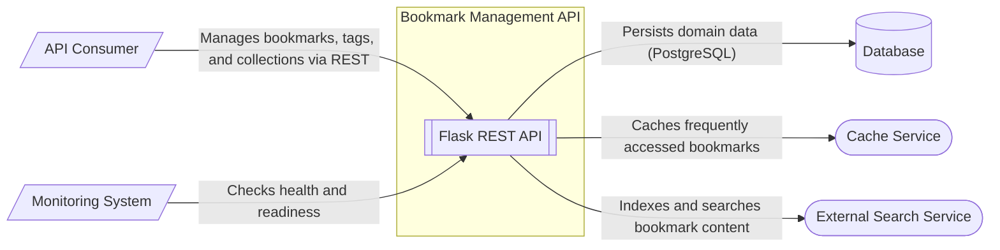

# System Context Diagram for Bookmark Management API

This system context diagram illustrates the architecture of the Bookmark Management API (Pagemark). The central Flask-based API orchestrates interactions between users and several external services. 

The API provides a RESTful interface for API Consumers to manage bookmarks, tags, and collections. It relies on a [Data Persistence](/guides/data-persistence) (PostgreSQL) for persistent storage of domain entities. To optimize performance, it utilizes a [In-Memory Storage Architecture](/guides/data-persistence/in-memory-storage-architecture) (implemented as an LRU cache) for frequently accessed bookmark data. Full-text search capabilities are provided by an [Search Architecture](/guides/search-indexing/search-architecture) (such as Typesense or Elasticsearch), which the API keeps in sync by indexing bookmarks as they are created or updated. Additionally, the system exposes internal health and diagnostic endpoints for use by Monitoring Systems and load balancers.

**Key Architectural Findings:**
- The system is a Flask-based REST API following a layered architecture (Routes -> Services -> Repository).
- Data persistence is handled by a repository layer, which is designed to interface with a PostgreSQL database (stubbed in the current implementation).
- An internal LRU cache is used by the service layer to reduce database load for frequent bookmark lookups.
- Full-text search is implemented via a search index service, intended to be replaced by external services like Elasticsearch or Typesense in production.
- Internal health and readiness probes are provided for infrastructure monitoring and load balancing.

