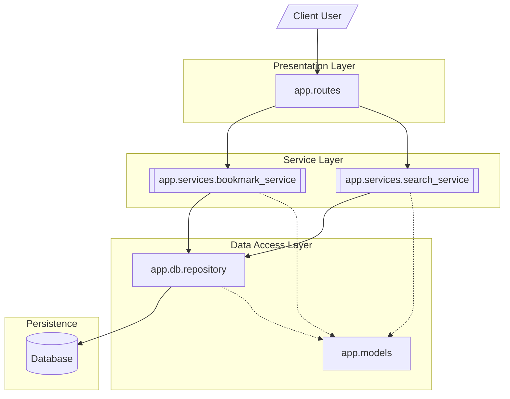

# Backend Service Component Architecture

This diagram illustrates the internal layered architecture of the Flask application, detailing the flow from [Backend Service Component Architecture](/architecture/architecture-overview/backend-service-component-architecture) through the [Core Services](/guides/core-services) to the [Repository Overview](/guides/persistence-layer/repository-overview). It highlights the separation of concerns between business logic and data persistence.

